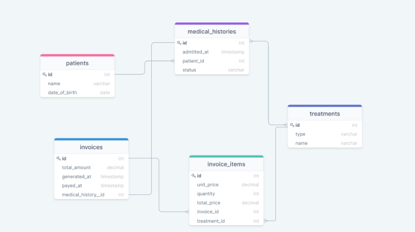

# Create a DataBase based on a diagram 

This is a database created using PostgreSQL based on a medical database diagram.

## Getting Started

This repository includes files with plain SQL that can be used to recreate a database:

- Use [schema.sql](./schema.sql) to create all tables.
- Use [data.sql](./data.sql) to populate tables with sample data.
- Check [queries.sql](./queries.sql) for examples of queries that can be run on a newly created database. **Important note: this file might include queries that make changes in the database (e.g., remove records). Use them responsibly!**

## Authors

👤 **Sheyla Pozo**

- Github: [@SheylaPozo](https://github.com/sheylaPozo)

- Twitter: [@SheyPozo](https://twitter.com/sheyPozo)

- LinkedIn: [Sheyla Pozo](https://www.linkedin.com/in/sheypozo/)

👤 **Stephan Annandale**

- Github: [@sneeu-leeu](https://github.com/sneeu-leeu)

- Twitter: [@Stephan07484055](https://twitter.com/Stephan07484055)

- LinkedIn: [Stephan Annandale](https://www.linkedin.com/in/stephan-annandale-a4b4931a9/)

## 🤝 Contributing

Contributions, issues, and feature requests are welcome!

Feel free to check the [issues page](../../issues/).

## Show your support

Give a ⭐️ if you like this project!

## Acknowledgments

- Hat tip to anyone whose code was used
- Inspiration
- etc

## 📝 License

This project is [MIT](./MIT.md) licensed.